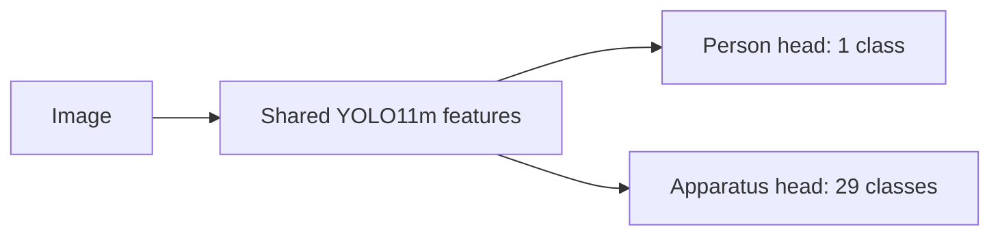

# Dual-Head YOLO: People and Laboratory Apparatus

Can one feature extractor serve two detection tasks without hurting either one?

This research prototype adapts YOLO11m with a shared backbone and neck, a person detection head, and a separate head for 29 laboratory-related classes. The apparatus labels include hands. Each image supervises the task for which labels are available.

## How it works



Training uses single-image batches and randomly interleaves the two datasets. The current fine-tuning script explicitly unfreezes shared parameters and uses person/apparatus loss weights of 4:1.

## An observed trade-off

An exploratory one-epoch fine-tuning run improved apparatus scores while reducing person scores:

| Task | Before AP50 | After AP50 | Before AP50–95 | After AP50–95 |
|---|---:|---:|---:|---:|
| Person | 0.6039 | 0.5110 | 0.3271 | 0.2549 |
| Apparatus | 0.4213 | 0.5717 | 0.2524 | 0.3572 |

These are results from the project's custom evaluator, on its fixed task-specific test splits. The run changed task weighting and shared-parameter training together; it does not isolate their individual effects or establish negative transfer against a matched single-task baseline. See [the experiment record](experiments/one-epoch-finetune/comparison.md) and its JSON metrics/configuration.

## Code map

| File | Purpose |
|---|---|
| `dual_head_model.py` | Shared YOLO11m feature extraction and two detection heads |
| `dual_dataset.py`, `dual_collate.py` | Dataset loading and task-specific labels |
| `dual_loss.py`, `loss_wrapper.py` | Task-weighted detection loss |
| `train_dual_head.py` | Fine-tuning, validation, and checkpoints |
| `evaluate_dual.py` | Per-task and per-class evaluation |

## Running the prototype

Use Python 3.12 and install PyTorch appropriate for your device. The recorded environment used PyTorch 2.8.0 with CUDA 12.8 and Ultralytics 8.4.137.

```powershell
python -m venv .venv
.\.venv\Scripts\Activate.ps1
python -m pip install torch==2.8.0 torchvision==0.23.0 --index-url https://download.pytorch.org/whl/cu128
python -m pip install -r requirements.txt
```

Prepare YOLO-format labels under the following layout:

```text
data/person/{train,val,test}/{images,labels}/
data/apparatus/{train,valid}/{images,labels}/
data/apparatus/test/{ChemEq25,SecondDataset}/{images,labels}/
```

Set `PERSON_DATA_ROOT` and `APPARATUS_DATA_ROOT` if the data lives elsewhere. Fine-tuning requires your existing dual-head checkpoint, which is not bundled:

```powershell
$env:DUAL_FINETUNE_WEIGHTS = 'checkpoints/dual_head_best.pt'
python train_dual_head.py
$env:DUAL_EVAL_WEIGHTS = 'dual_head_finetune_p4_a1_best.pt'
python evaluate_dual.py
```

The current training script defaults to five epochs; the recorded comparison used a separate one-epoch run documented in its configuration. Pretrained YOLO11m weights are supplied through Ultralytics. Model channel indices are specific to YOLO11m.

## Limits and next experiments

- Keep `batch_size=1`: mixed-task batches need prediction filtering and index remapping before increasing the batch size.
- This repository does not distribute the datasets or trained checkpoints. The reported fine-tuning experiment requires the original data split and initial checkpoint for exact reproduction.
- No same-scene, fully annotated people-and-apparatus deployment accuracy has been established.
- Next: compare matched single-task baselines, audit task sampling, and evaluate fully annotated laboratory scenes.

The publication copy replaces local machine paths with configurable paths. Its Python syntax has been checked; training and evaluation have not been rerun from this exported folder.
